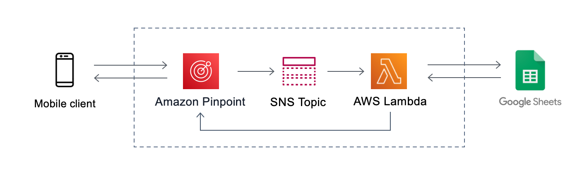

# friend-to-send
AWS based infrastructure to send daily text messages to reach out to friends. Each day it selects a random user from a google sheets database and sends me a text message with info such as the following:
* First/last name
* phone number/email
* last time we chatted
* current job/title
* facebook/linkedin links
* notes from previous chats

This utilizes AWS Pinpoint, AWS SNS (Simple Notification Service), and AWS Lambda.

